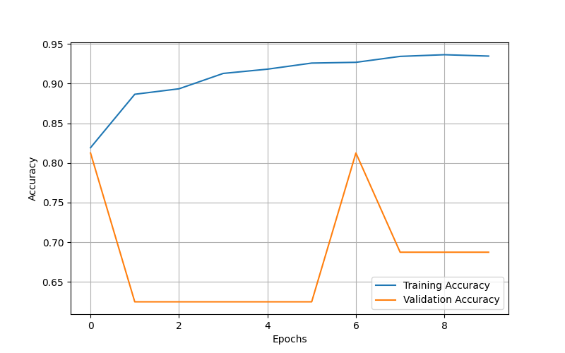
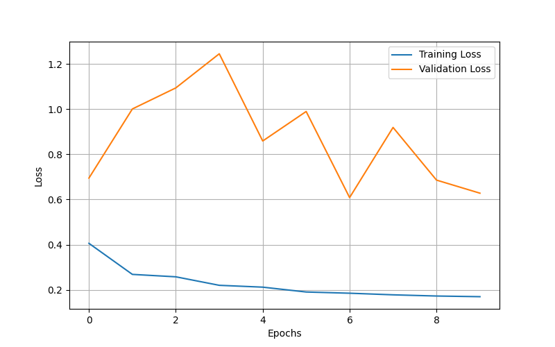
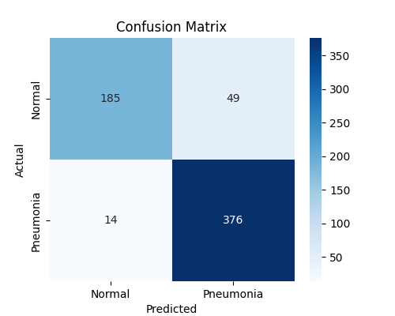

# Pneumonia Detection Using Convolutional Neural Network (CNN)

## Project Overview
This project focuses on detecting Pneumonia from Chest X-ray images using a deep learning
model based on Convolutional Neural Networks (CNN). The model classifies X-ray images into
two categories: Pneumonia and Normal.

## Objective
To build an automated system that can accurately detect Pneumonia from chest X-ray images
and assist in early diagnosis.

## Dataset
- Chest X-Ray Images (Pneumonia & Normal)
- Source: Kaggle
- Dataset is divided into:
  - Train
  - Validation
  - Test

## Model Architecture
- Convolutional Neural Network (CNN)
- Conv2D and MaxPooling layers
- Fully connected Dense layers
- Sigmoid activation for binary classification

## Features
- Image preprocessing and normalization
- Data augmentation
- Model training and fine-tuning
- Test set evaluation
- Confusion Matrix and Accuracy/Loss graphs
- New image upload and Pneumonia detection
- Incremental retraining demonstration

## Technologies Used
- Python
- TensorFlow
- Keras
- NumPy
- Matplotlib
- Scikit-learn
- Google Colab

## How to Run the Project
1. Open the notebook in Google Colab
2. Ensure dataset is placed in the `dataset` folder
3. Run all cells to train the model
4. Trained models are saved in the `model` folder
5. Results and graphs are saved in the `results` folder
6. Use prediction code to test new X-ray images

### Training Accuracy

### Training Loss

### Confusion Matrix

## Results
- Training Accuracy: ~93–95%
- Validation Accuracy varies due to small validation set
- Model performs well on clear Pneumonia cases

## Limitations
- Performance may reduce on early-stage Pneumonia
- Low-quality or blurred X-ray images
- Pediatric chest X-rays
- Retraining with a single image is for demonstration only

## Future Scope
- Training on larger and more balanced datasets
- Integration with a web-based or mobile application
- Multi-disease classification (COVID-19, TB)
- Explainable AI techniques (Grad-CAM)

## Author
Khushi Giri
3rd year 5th semester  
B.Tech Computer Science & Engineering  
Galgotias University
